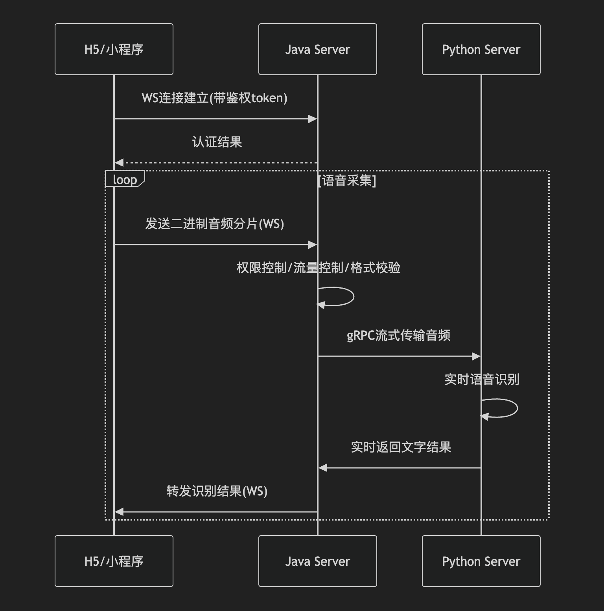
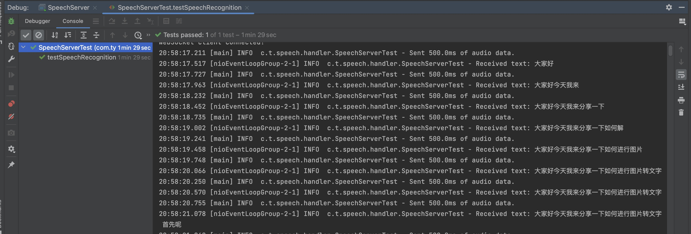

# 实时语音转文字

## 功能模块全览

```
H5/mini Program
    -- 实时声音采集
    -- ws发送语音片断给Java Server
Java Server
    -- 监听接收客户端上传的实时语音片断
    -- 权限校验
    -- 流量控制
    -- 音频格式校验
    -- 使用gRPC流式传给 Python Server
    -- 接收Python Server的实时解析结果并发给客户端
Python Server
    -- 接收Java程序通过gRPC上传的语音片断
    -- 流式、非流式语音转文字
    -- 实时返回转文字结果
```




## 体验一下

### 1.下载并运行 python server 模块

地址：https://github.com/TongDaxia/realtime_voice_to_text_engine
我在python项目中也提供了测试用例用于验证。

### 2.下载并运行本java服务

### 3.运行本项目的测试用例
本项目中提供了若干单侧用例。
比如运行 SpeechServerTest.java 之后会看到如下的结果：




## 本项目的项目结构
```agsl

src/
├── main/
│   ├── java/
│   │   └── com/
│   │       └── example/
│   │           └── speech/
│   │               ├── config/
│   │               │   └── AppConfig.java
│   │               ├── handler/
│   │               │   ├── AuthHandler.java
│   │               │   ├── SpeechWebSocketHandler.java
│   │               │   └── HttpRequestHandler.java
│   │               ├── rpc/
│   │               │   ├── PythonSpeechClientPool.java
│   │               │   ├── PythonSpeechClient.java
│   │               │   └── SpeechGrpc.java
│   │               │   └── SpeechProto.java
│   │               ├── service/
│   │               │   ├── AuthService.java
│   │               │   └── SpeechRecognitionService.java
│   │               ├── util/
│   │               │   ├── AudioUtils.java
│   │               │   └── LogUtils.java
│   │               └── SpeechServer.java
│   └── resources/
│       └── application.properties
│       └── logback.xml
└── test/
└── java/
└── com/
└── example/
└── speech/
├── handler/
│   └── SpeechWebSocketHandlerTest.java
└── service/
└── SpeechRecognitionServiceTest.java
```

## Todo list

1. H5页面和微信小程序页面还没有开发
2. 鉴权部分暂时还没有实现
3. 目前文件的发送和识别是两个独立的过程，计划把识别的块和当前的块关联起来
4. 目前如果识别延迟，可以考虑对之前的音频流进行适当舍弃
5. 在java测对分片文件进行落盘持久化 


